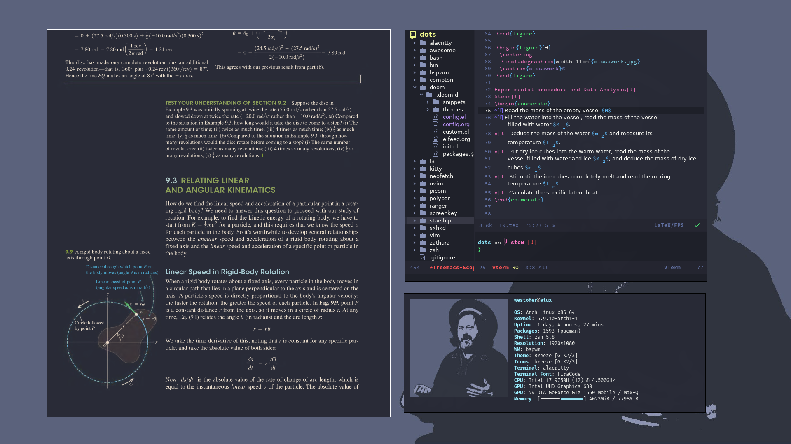
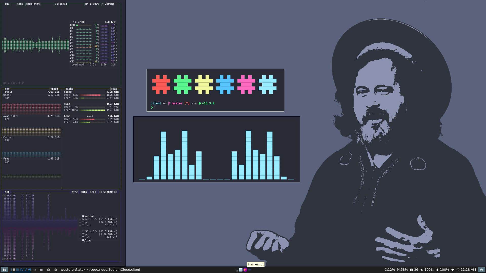
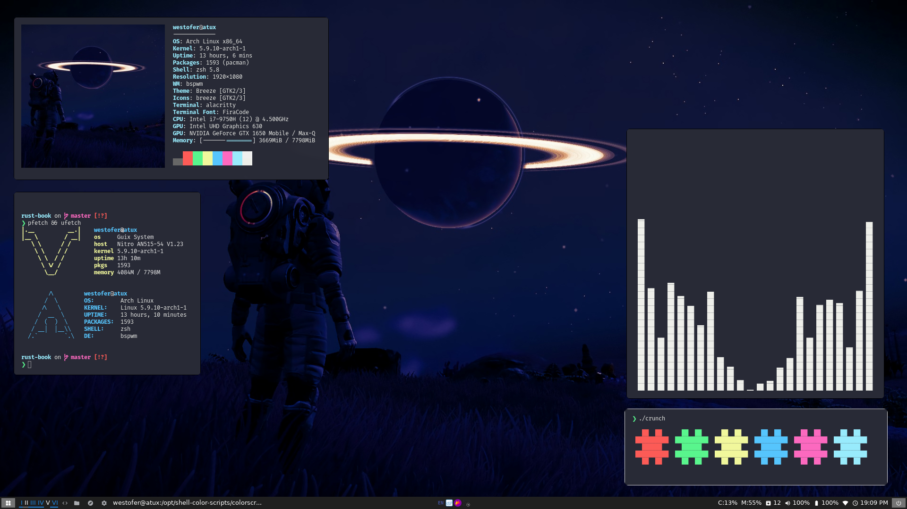

# dotfiles

My ~




To semilink

```sh
stow target=$HOME nvim vim bspwm picom ....
```

## Notes to Future me:

- neovim requires .vimrc
- you use doom emacs so `.emacs.d/bin/doom build` after cloning doom repo
- oh-my-zsh requires cloning
- snazzy is your color scheme

```sh
# Aur
tdrop-git

```

<!-- cpupower-gui -->
<!-- fswatch -->
<!-- notification-daemon -->
<!-- xodotools -->
<!-- jmtpfs -->
<!-- org-protocol-emacsclient -->
